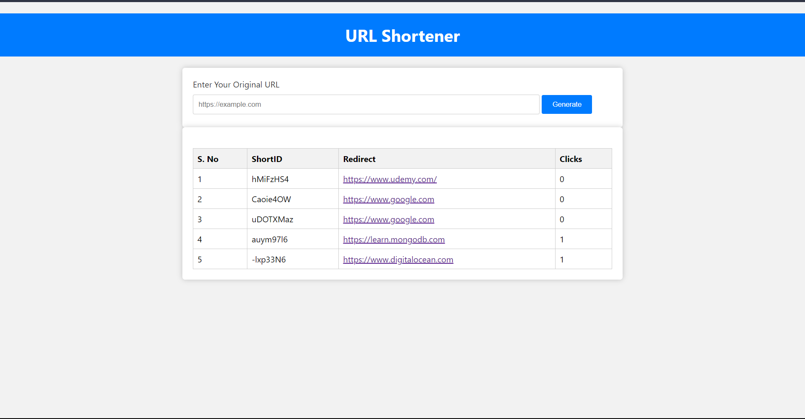
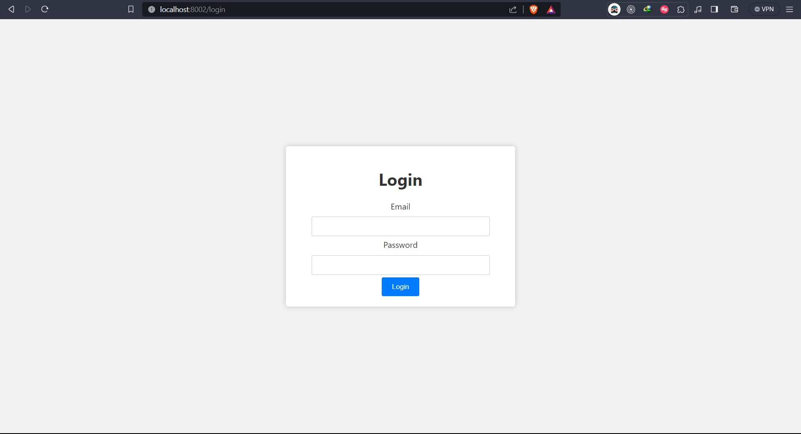
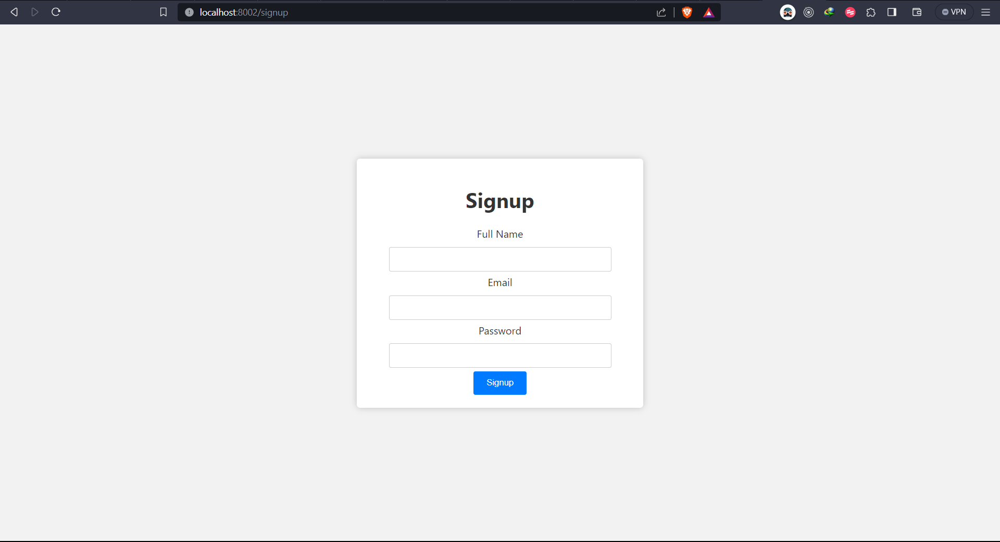
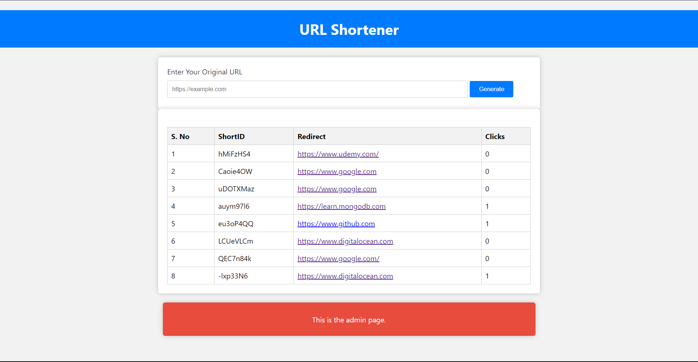

# SHORT-URL

 This is a URL shortener project built with Node.js, Express, MongoDB, and EJS for rendering views. It allows users to shorten long URLs and provides basic analytics for the shortened URLs.

## Table of Contents

- [Project Structure](#project-structure)
- [Installation](#installation)
- [Usage](#usage)
- [Routes](#routes)
- [License](#license)

## Project Structure

The project structure is organized as follows:

- `controllers`: Contains controllers for handling URL generation, analytics, user signup, and login.
- `middleware`: Contains middleware functions for authentication and authorization.
- `models`: Defines Mongoose models for URL and user data.
- `routes`: Defines route handlers for various endpoints.
- `views`: Contains EJS templates for rendering HTML views.
- `connect.js`: Establishes a connection to the MongoDB database.
- `index.js`: The main entry point of the application.
- `package.json`: Contains project metadata and dependencies.

- ## Installation

To run this project locally, follow these steps:

1. Clone the repository to your local machine:

   ```bash
   git clone https://github.com/ansh2822/SHORT-URL.git

2. Install project dependencies.
   ```bash
   npm install

3. Connect to MongoDB.
   . Make sure you have MongoDB installed and running locally on its default port (27017).
   . [Check out the installation guide]('https://www.mongodb.com/docs/manual/tutorial/install-mongodb-on-windows/#install-mongodb-community-edition')

4.The application should now be running at http://localhost:8002.

## Usage

- Access the URL shortener interface by visiting http://localhost:8002.
- Users can enter their original long URLs to generate shortened URLs.
- Shortened URLs are displayed along with the number of clicks.
- Admins can access an admin page to view all shortened URLs.
- Users can sign up and log in to access more features.

## Routes
- `/`: Home page for URL shortening.
- `/signup`: Sign-up page for new users.
- `/login`: Login page for registered users.
- `/admin/urls`: Admin page for viewing all shortened URLs.
- `/url`: API endpoint for generating new shortened URLs.
- `/url/:shortId`: Redirects to the original URL and records the visit.
- `/user`: API endpoint for user registration.
- `/user/login`: API endpoint for user login.

## Screenshots
Here are some screenshots of the URL Shortener application:

- 
  - *The login.ejs page is the user interface for user authentication within the URL Shortener application. It provides a straightforward and user-friendly login experience.*

- 
  - *The signup.ejs page serves as the registration portal for new users interested in using the URL Shortener application. It offers a streamlined and secure process for creating an account.*

- 
  - *The urlsAdmin.ejs page is the administrative dashboard for the URL Shortener application, designed specifically for users with administrative privileges. It provides comprehensive control over URL management and analytics.*
